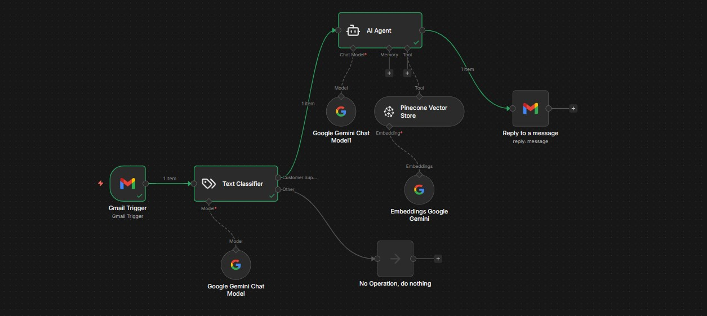

# 🤖 Customer Support Agent Workflow

This repository contains the **Customer Support Agent Workflow**, built using [n8n](https://n8n.io/). The workflow is designed to streamline customer support processes by automatically categorizing incoming emails and routing them appropriately.



## 📋 Workflow Overview

### 🔧 Nodes Used:

1. **📧 Gmail Trigger**

   - Monitors a Gmail account for new emails.
   - Polls every minute to check for incoming messages.

2. **🧠 Text Classifier**

   - Uses a text classification model to categorize emails into predefined categories:
     - **Customer Support** 💬: Emails related to customer inquiries about policies, products, or services.
     - **Other** 📬: Emails not related to customer support.

3. **🤖 AI Agent** (Optional)

   - Processes customer support-related emails for further actions.

4. **⏸️ No Operation (Do Nothing)**
   - Handles emails categorized as "Other."

---

## 🔗 Workflow Connections

1. **📧 Gmail Trigger → 🧠 Text Classifier**

   - The Gmail Trigger node sends the email content to the Text Classifier node.

2. **🧠 Text Classifier → 🤖 AI Agent**

   - Emails categorized as "Customer Support" are routed to the AI Agent node for further processing.

3. **🧠 Text Classifier → ⏸️ No Operation**
   - Emails categorized as "Other" are routed to the No Operation node.

---

## ✅ Prerequisites

- **n8n instance** (Desktop, Cloud, or Self-hosted).
- **Google Cloud Project** with the Google Drive API enabled.
- **Google AI Studio API Key** (Free tier from [aistudio.google.com](https://aistudio.google.com)).
- **Pinecone Namespace** named `FAQ`

---

## 🚀 Setup Instructions

1. **📥 Clone the Repository**  
   Clone this repository to your local machine:

   ```bash
   git clone https://github.com/your-repo/customer-support-agent-workflow.git
   ```

2. **📤 Import the Workflow**

   - Open n8n.
   - Import the `Customer Support Workflow.json` file from the repository.

3. **🔑 Configure Credentials**

   - Create your **Google Drive OAuth2** credentials.
   - Create your **Google Gemini(PaLM) API** credentials.
   - Create your **Pinecone API** credentials.

4. **▶️ Run the Workflow**
   - Activate the workflow to start processing incoming emails.

---

## ⚙️ Customization

- **📂 Categories**: Update the categories in the "Text Classifier" node to suit your specific needs.
- **➕ Additional Nodes**: Add more nodes to extend the workflow functionality, such as sending automated replies or logging data.
- **💬 Better Prompts**: Update the prompts on the AI Agents to better understand and respond to the emails.
- **🧠 Different AI Models**: You can use other AI Models (OpenAI, Claude, Perplexity) if you want to.

---

## Support

For issues or feature requests, please open an issue in this repository.
